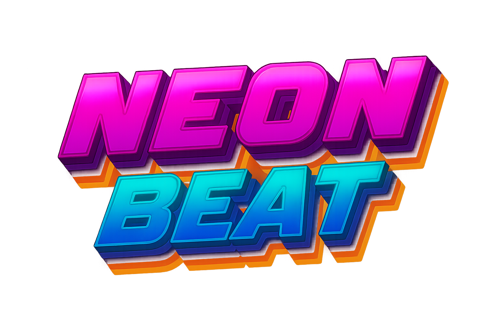

# Neon Beat

Welcome to the Neon Beat project space !

## What is Neon Beat ?

Neon Beat is a blindtest platform involving both custom software and
hardware. The game platform involves the following components:
- a hardware game controller based on a Raspberry PI and a USB WiFi dongle
- a specific software stack running on this controller:
  - a core game controller
  - a web server exposing both players interface and the admin interface
  - an access point for buzzers
- buzzers: each team is supposed to take part in the game thanks to a
  dedicated arcade button.
- a web playlist creator ([Neon Beat Playlist
  Creator](https://neon-beat.github.io/neon-beat-playlist-creator/))

You can find all the related software components source code in this
organization. The overall project, while being mature enough to allow
running games, is still receiving new features, fixes et documentation.

## I want to deploy my own Neon Beat game !

As stated above, the project is still maturing, so the documentation is
still a bit lacking on this point, but you can still give it a try, as you
have access to all the needed software. The best entry point is likely the
[Neon Beat Controller
repository](https://github.com/neon-beat/neon-beat-controller).

## I want to notify you about a feature request or an issue

Feel free to open an issue in the 
[Neon Beat issues repository](https://github.com/neon-beat/issues/) so
that we can take a look at it !

